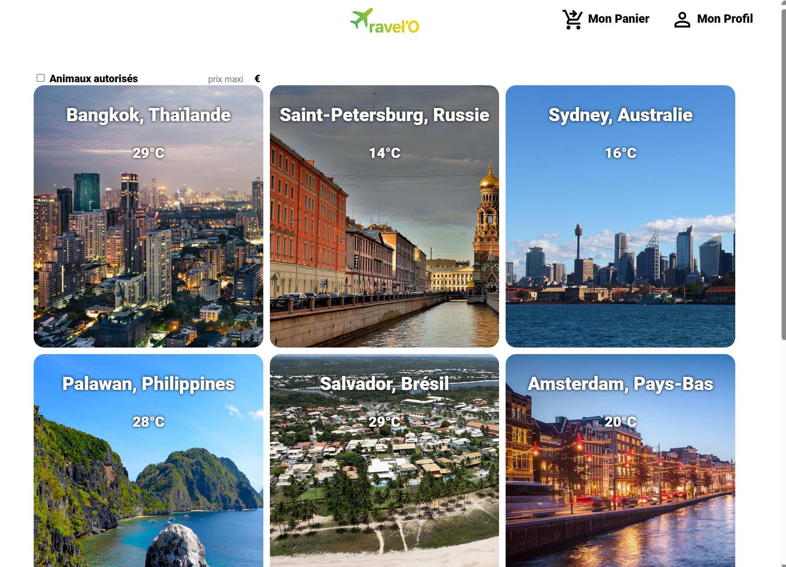

# Travel Discovery & Booking Web Application

A client-side travel booking and discovery platform built with vanilla JavaScript, HTML5, and CSS3. Developed as part of the Web Technologies curriculum at CPE Lyon.

## Overview

This application provides a complete travel reservation workflow across global destinations. It connects to the OpenWeatherMap API to display real-time local weather forecasts for each travel spot, while managing user cart and booking persistence locally without requiring a dedicated backend server.

## Features

- **Dynamic Catalog & Filtering:** Search and browse destinations dynamically with instant filtering based on criteria.
- **Live Weather Integration:** Real-time temperature and meteorological status retrieved asynchronously via the OpenWeatherMap REST API (Fetch / Promises) with robust fallback handling in case of API failure.
- **Client-Side State Persistence:** Full cart state management, booking history, and user profile persistence using the browser's localStorage and sessionStorage.
- **Form Validation & Checkout Workflow:** Strict client-side validation pipelines verifying travel dates, passenger counts, pricing calculations, and simulated payment inputs.
- **Modular Frontend Architecture:** Shared header/footer components and separated stylesheets for a maintainable multi-page structure.

## Project Structure

- `html/` : Multi-page architecture (catalog, destination details, booking, cart, checkout, profile)
- `js/` : Dedicated scripts for asynchronous API calls, state persistence, and DOM logic
- `styles/` : Modular CSS stylesheets and responsive rules
- `destinations/` : Destination mock datasets and associated media
- `keys.json.example` : Configuration template for external API keys

## Getting Started

### Prerequisites

- Any modern web browser (Chrome, Firefox, Safari, Edge).
- An API key from OpenWeatherMap (free tier).

### Installation & Setup

1. Clone the repository:

    git clone [https://github.com/Aquila2san/projet-3eti-tlw.git](https://github.com/Aquila2san/projet-3eti-tlw.git)
    cd projet-3eti-tlw

2. Configure your API key:

    cp keys.json.example keys.json

Edit keys.json and add your API key:

    {
      "weatherAPI": "YOUR_OPENWEATHERMAP_API_KEY"
    }

3. Launch the application:

Open `html/mainPage.html` directly in your browser.

Binôme composé de :
-SAUNIER Victor
-TOURAUD Dorian
3ETI Groupe A

La clé API de OpenWeatherMap est présente dans le dépot, nous avons jugé inutile de l'enlever puisque le dépot gitHub est privé.

SOURCES DES ICONES:
https://fonts.google.com/
Photo prises de Pixabay, Unsplash

DESTINATIONS:
Bangkok, Thaïlande;
Sydney, Australie;
Saint Petersbourg, Russie;
Salvador, Brésil;
Palawan, Philippines;
Putrajaya, Malaisie;
